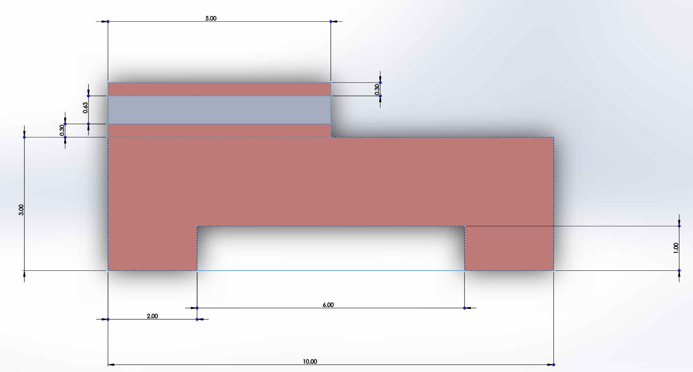
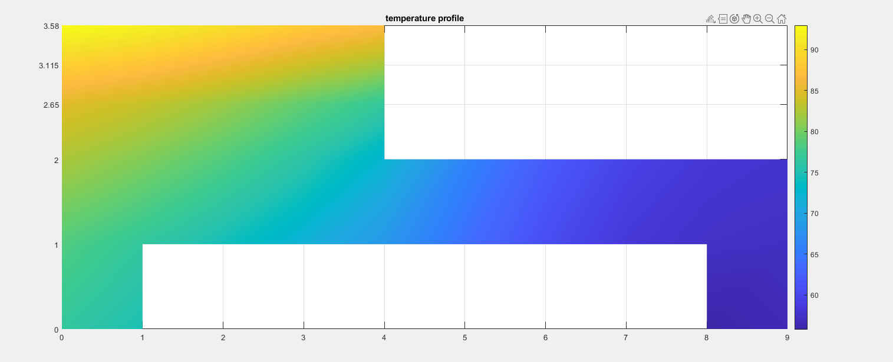
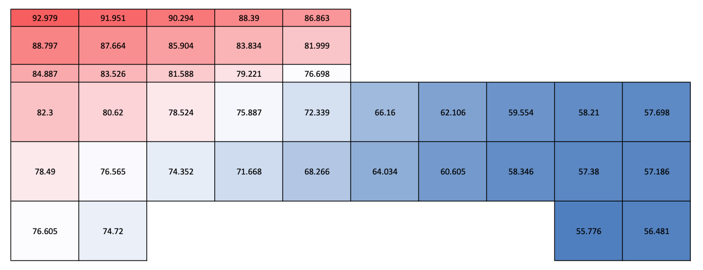
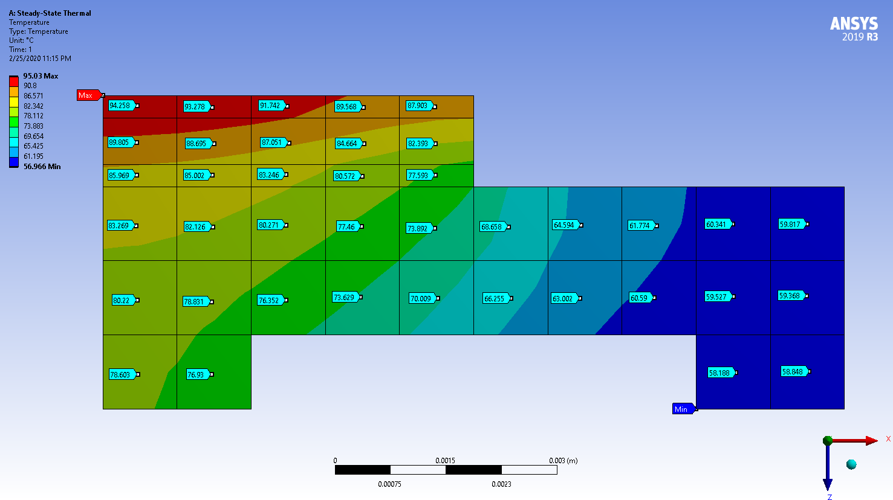

# TwoDimensionalSteadyStateConductionSolver

## Project Description
This project is aimed at solving a steady-state heat conduction problem in a two-dimensional domain through a numerical method.

## Project Overview

### Temperature Domain Dimension

All the figures are in millimeter.

### Results (All in ºC)

#### Temperature Profile Contour

#### Temperature Profile Result

### Control Result (By ANSYS Workbench)

## Prepare for Developing
This section will guide you through the software and tools required for building this project.

### Software List
* Visual Studio Code
* Matlab
* vscode-icons

### Visual Studio Code
Visual Studio Code, also known as VSCode, is a popular and powerful text editor for developers. A good text editor is crucial for speeding up the coding process and debugging process.

#### Install Visual Studio Code
We recommend to use the official website for downloading the packages.
Please go to [https://code.visualstudio.com/](https://code.visualstudio.com/) and follow the instruction on the web page.

#### Recommended Extensions
We recommend you to install the listed extensions for boosting your coding experience with VSCode
* Matlab
* vscode-icons

### MATLAB
MATLAB is also known as Matrix Laboratory, which is a programming and numeric computing tool for solving not only mathematical problems but also engineering problems.

#### Install MATLAB
Please go to [mathworks.com](https://www.mathworks.com/products/matlab.html), the official website for MATLAB, and download the software. MATLAB provides academic version for college student; you may need to use your .edu email to set up an account.

## Physical Background

### What is Heat Conduction?
When it comes to the word conduction, we might immediately come with some stuffs about electricity, like a conductor or current.  Generally, a metal wire can conduct electricity because it contains free electron. The “force” that pushes the current is simply voltage. However, when it comes to heat conduction, things are getting more complicated. Similarly, the “force” of heat conduction is the temperature difference. Differently, there is no directional flow of particles in conduction when the heat goes from one place to another. It is just the flow of energy, and the energy flow is coursed by the atoms colliding and hitting on a molecular scale. 

A temperature difference exists between the tip and the tail of the iron bar. This temperature difference drives the heat to dissipate.

### What is a Steady State?
The definition of a steady state is defined as a condition in a physical process when its states are no longer time dependent.

### Why use numerical methods?
The analytical solution usually involves complicated mathematical series, for example, the Fourier series. Also, even we could get the analytical solution; the solutions were usually restricted to a few sets of simple conditions. However, solutions are a set of temperatures, and the temperature of each point is continuous and determined by independent variables; its location (x, y). Different from the analytical methods, numerical methods will only give us an approximation of each point. Ignore the effect of error accumulation; the more points are set, the more accurate the result will be.

### Energy Balance Method
The energy balance method is simply an application of the law of energy conservation. The energy goes in minus the energy goes out then plus the energy generated within the control volume must equal to the energy storage inside that control volume. 
